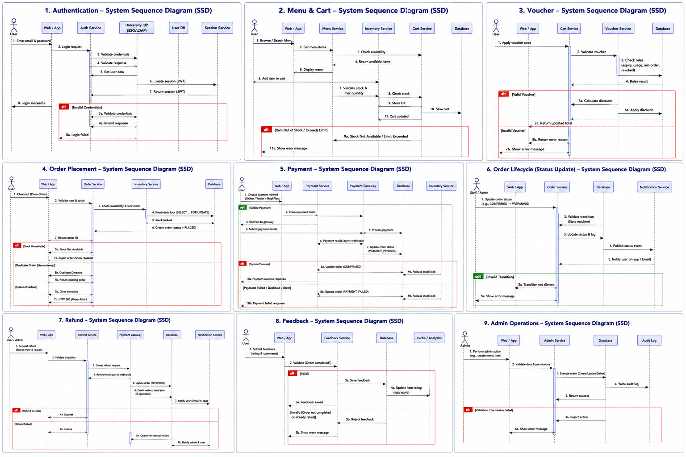
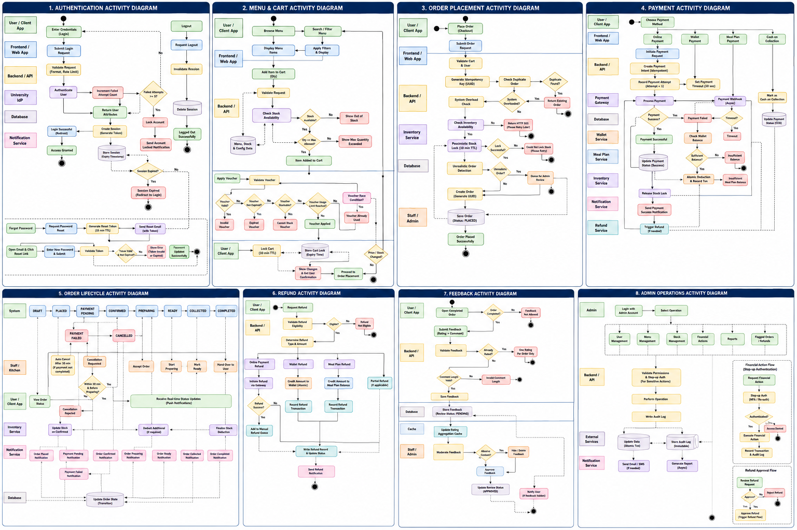

**University Cafeteria Ordering System**

# Phase 1 --- Requirement Discovery & Traceability {#phase-1-requirement-discovery-traceability}

1.  **Actor Classifications:**

<!-- -->

1)  **Primary Actors --- directly initiate system use cases:**

<!-- -->

1)  **Student / User:**

> The central human actor. Initiates every customer-facing flow: authentication, menu browsing, cart management, order placement, payment, order tracking, cancellation, and feedback submission. All UI-facing FRs in categories Menu & Cart, Order Placement, Payment, Order Lifecycle, and Feedback are triggered by this actor.
>
> Traced to: FR01--FR08 FR09--FR17 FR20--FR26 FR33--FR38 FR47
>
> **Rationale:** All UI design (NFR25--NFR27) is calibrated to their mobile-first usage patterns (NFR26). They bear the primary goal of the system: order food efficiently.

2)  **Staff:**

> Operational actor who fulfils orders. Advances order state through the state machine (CONFIRMED → PREPARING → READY → COLLECTED). May cancel in-progress orders with a reason code. Cannot access financial reports or admin functions (FR51).
>
> Traced to: FR35 FR39 FR41 FR45 FR51
>
> **Rationale:** Has unique permissions not shared with Student or Admin. Is an explicit actor in every state machine transition.Their physical food preparation actions drive the irreversibility of cancellation rules (FR38).

3)  **Administrator:**

> Highest-privilege human actor. Manages users, menu, system configuration, financial balances, refund queues, and flagged orders. Requires step-up authentication for financial actions (FR55, NFR18).
>
> Traced to: FR07 FR18--FR19 FR24 FR39 FR49--FR56
>
> **Rationale:** Explicitly declared in FR07 with a named role. Has non-overlapping permissions from Staff (NFR15). Sole actor who can approve flagged orders (FR56) and access revenue reports (FR53).

2)  **Supporting Actors --- provide services consumed by the system:**

<!-- -->

1)  **Payment Gateway:**

> PCI-DSS-compliant external payment processor. Handles all card processing asynchronously via webhooks. Provides refund API. The system stores only gateway transaction reference IDs (NFR17). Failures, timeouts, and retry idempotency are extensively specified.
>
> Traced to: FR27--FR32 FR42 FR44 NFR03 NFR08 NFR17
>
> **Rationale:** The most dependency-intensive external actor. Has its own circuit-breaker pattern (NFR08) and three distinct failure modes specified as edge cases (FR28, FR29, FR30).

2)  **Notification Service:**

> Async job responsible for sending in-app and email order confirmation notifications (FR33). Decoupled from order status --- notification failure does not affect order state.
>
> Traced to: FR33 NFR28
>
> **Rationale:** Explicitly described as an async background job in FR33. Its decoupled nature confirms it as a supporting service, not a primary flow actor.

3)  **Offstage Actors --- invisible stakeholders who shape requirements:**

<!-- -->

1)  **University Finance / Auditors:**

> Never interact with the system directly but drive immutable audit log requirements (NFR20, NFR32), financial transaction retention (NFR31), and the 2-year log retention policy. Their audit requirements shape the entire refund tracking schema (FR46).
>
> Traced to: FR46 NFR20 NFR31 NFR32
>
> Rationale: NFR32 explicitly states requirements must \"satisfy university financial audit requirements.\" This stakeholder sets non-negotiable compliance constraints without ever touching the UI.

2)  **Malicious / Erroneous User:**

> An implicit threat actor whose existence is acknowledged in SRS §2 (\"resilient to ... malicious or erroneous inputs\"). Drives brute-force protection (FR03), rate limiting (NFR19), OWASP mitigations (NFR21), bulk order detection (FR24), voucher abuse prevention (FR14--FR16), and SQL injection prevention (NFR16).
>
> Traced to: FR03 FR14--FR16 FR24 NFR16 NFR19 NFR21
>
> **Rationale:** Explicitly named in §2 scope. Every security requirement is fundamentally a response to this actor\'s potential behaviour.

2.  **Traceability Heatmap:**

3.  **Section 1 --- Feature-to-Requirement Traceability Heatmap**

> Each row maps a system feature to its source FR IDs, Gherkin scenario coverage (Phase 2), state machine alignment, edge case classification, and NFR links. Orphaned or partially-covered cells indicate test or documentation debt.

| **Feature / Use Case**                  | **FR IDs**               | **Gherkin Coverage** | **State Machine**                  | **Edge Case** | **NFR Links**  | **Notes**                             |
|-----------------------------------------|--------------------------|----------------------|------------------------------------|---------------|----------------|---------------------------------------|
| **▶ Authentication**                    |                          |                      |                                    |               |                |                                       |
| Login with university credentials       | *FR01, FR02*             | **✔ Full**           | **N/A**                            | **✔ Full**    | *NFR12, NFR14* | JWT tokens, IdP integration           |
| Account lockout (5 failed attempts)     | *FR03*                   | **✔ Full**           | **N/A**                            | **⚠ Edge**    | *NFR19*        | 15-min lock, IP logging               |
| Session expiry on inactivity            | *FR04*                   | **✔ Full**           | **N/A**                            | **⚠ Edge**    | *NFR14*        | 30-min TTL, Redis blacklist           |
| Logout & session invalidation           | *FR05*                   | **\~ Partial**       | **N/A**                            | **N/A**       | *NFR14*        | Multi-device coverage                 |
| Password reset (time-limited link)      | *FR06*                   | **\~ Partial**       | **N/A**                            | **⚠ Edge**    | *NFR13*        | 15-min link, single-use               |
| Role assignment by admin                | *FR07*                   | **✘ None**           | **N/A**                            | **N/A**       | *NFR15*        | No Gherkin yet                        |
| Reject suspended/expired accounts       | *FR08*                   | **✔ Full**           | **N/A**                            | **⚠ Edge**    | *NFR15*        | Graduated student scenario            |
| **▶ Menu & Cart**                       |                          |                      |                                    |               |                |                                       |
| Browse menu by category                 | *FR09, FR10*             | **✔ Full**           | **N/A**                            | **N/A**       | *NFR01, NFR04* | Meals/Beverages/Snacks filters        |
| Search menu by keyword                  | *FR10*                   | **✔ Full**           | **N/A**                            | **N/A**       | *NFR04*        | \<1s p95 requirement                  |
| Add items to cart; out-of-stock blocked | *FR11, FR12*             | **\~ Partial**       | **N/A**                            | **N/A**       | *NFR22*        | Quantity max cap enforced             |
| Voucher application & validation        | *FR13, FR14, FR15, FR16* | **✔ Full**           | **N/A**                            | **⚠ Edge**    | *NFR23*        | Single-use, expiry, stacking          |
| Cart lock at checkout                   | *FR17*                   | **\~ Partial**       | **DRAFT→PLACED**                   | **⚠ Edge**    | *NFR22*        | Price-change protection               |
| Menu item management (Admin)            | *FR18, FR19, FR52*       | **✘ None**           | **N/A**                            | **⚠ Edge**    | *NFR24*        | Soft-delete, per-item cap             |
| **▶ Order Placement**                   |                          |                      |                                    |               |                |                                       |
| Place order with unique ID (idempotent) | *FR20, FR23*             | **\~ Partial**       | **DRAFT→PLACED**                   | **⚠ Edge**    | *NFR02*        | UUID v4, 60s dedup window             |
| Real-time stock check at placement      | *FR21, FR22*             | **\~ Partial**       | **N/A**                            | **⚠ Edge**    | *NFR11*        | Pessimistic lock, 10-min TTL          |
| Bulk/suspicious order detection         | *FR24, FR25*             | **✘ None**           | **N/A**                            | **⚠ Edge**    | *NFR09*        | Admin review queue, 503 circuit break |
| **▶ Payment**                           |                          |                      |                                    |               |                |                                       |
| Payment method selection                | *FR26*                   | **\~ Partial**       | **PLACED→PAYMENT_PENDING**         | **N/A**       | *NFR17*        | Card/Cash/Wallet/Meal Plan            |
| Online gateway payment                  | *FR27, FR30*             | **\~ Partial**       | **PAYMENT_PENDING→CONFIRMED**      | **⚠ Edge**    | *NFR03, NFR17* | Async webhook, idempotency key        |
| Gateway failure & retry                 | *FR28, FR29*             | **\~ Partial**       | **PAYMENT_PENDING→PAYMENT_FAILED** | **⚠ Edge**    | *NFR08*        | Max 3 retries, stock released         |
| Meal Plan payment & balance check       | *FR31*                   | **✘ None**           | **N/A**                            | **⚠ Edge**    | *NFR22*        | Full balance required, no partial     |
| Wallet atomic deduction                 | *FR32*                   | **✘ None**           | **N/A**                            | **⚠ Edge**    | *NFR22*        | SELECT FOR UPDATE, rollback on fail   |
| Order confirmation notification         | *FR33*                   | **✘ None**           | **N/A**                            | **N/A**       | *NFR28*        | Async, ≤30s, non-blocking             |
| **▶ Order Lifecycle**                   |                          |                      |                                    |               |                |                                       |
| Order state machine                     | *FR34, FR35*             | **\~ Partial**       | **✔ Full**                         | **N/A**       | *NFR20*        | All transitions logged                |
| Real-time order tracking (SSE)          | *FR36*                   | **✘ None**           | **N/A**                            | **N/A**       | *NFR28*        | SSE + 15s polling fallback            |
| User cancellation (2-min window)        | *FR37, FR38*             | **\~ Partial**       | **PLACED→CANCELLED**               | **⚠ Edge**    | *NFR20*        | Server-side enforcement               |
| Admin/Staff forced cancellation         | *FR39*                   | **✘ None**           | **CONFIRMED→CANCELLED**            | **N/A**       | *NFR20*        | Mandatory reason code                 |
| Auto-cancel abandoned checkout          | *FR40*                   | **✘ None**           | **PAYMENT_PENDING→CANCELLED**      | **⚠ Edge**    | *NFR10*        | 10-min TTL, cron every 1 min          |
| Stock inconsistency detection           | *FR41*                   | **✘ None**           | **N/A**                            | **⚠ Edge**    | *NFR22*        | Admin notified, order held            |
| **▶ Refunds**                           |                          |                      |                                    |               |                |                                       |
| Automatic refund on cancellation        | *FR42, FR43*             | **✘ None**           | **N/A**                            | **N/A**       | *NFR23*        | ≤2 biz days; Wallet/Meal Plan instant |
| Refund gateway failure handling         | *FR44*                   | **✘ None**           | **N/A**                            | **⚠ Edge**    | *NFR23*        | Admin queue, no silent drop           |
| Partial refund on partial fulfilment    | *FR45*                   | **✘ None**           | **N/A**                            | **⚠ Edge**    | *NFR22*        | Should-Have priority                  |
| Immutable refund audit log              | *FR46*                   | **✘ None**           | **N/A**                            | **N/A**       | *NFR32*        | Append-only, 2-yr retention           |
| **▶ Feedback**                          |                          |                      |                                    |               |                |                                       |
| Post-order rating & feedback            | *FR47*                   | **✘ None**           | **→COMPLETED**                     | **N/A**       | *NFR25*        | One per order, no edit                |
| Average rating on menu page             | *FR48*                   | **✘ None**           | **N/A**                            | **N/A**       | *NFR01*        | Should-Have; cached ≤5 min            |
| Admin feedback moderation               | *FR49*                   | **✘ None**           | **N/A**                            | **N/A**       | *NFR20*        | Soft-hide, hard-delete with reason    |
| **▶ Admin**                             |                          |                      |                                    |               |                |                                       |
| User account management                 | *FR50, FR51*             | **✘ None**           | **N/A**                            | **N/A**       | *NFR15*        | Role CRUD, suspend/reactivate         |
| Reports & exports                       | *FR53*                   | **✘ None**           | **N/A**                            | **N/A**       | *NFR05*        | CSV/PDF, async for \>90 days          |
| System config management                | *FR54*                   | **✘ None**           | **N/A**                            | **N/A**       | *NFR09*        | Live update ≤60s                      |
| Wallet/Meal Plan top-up (step-up auth)  | *FR55*                   | **✘ None**           | **N/A**                            | **N/A**       | *NFR18*        | Re-authentication required            |
| Flagged order review & approval         | *FR56*                   | **✘ None**           | **N/A**                            | **N/A**       | *NFR20*        | 60-min auto-cancel if no action       |

4.  **Section 2 --- Non-Functional Requirement Coverage**

> NFRs that are not fully traced to Gherkin scenarios or test strategies are listed below. Gaps represent test debt and should be scheduled before production sign-off.

| **ID**    | **Category**  | **Requirement Summary**                 | **Coverage**   | **Gap / Note**                            |
|-----------|---------------|-----------------------------------------|----------------|-------------------------------------------|
| **NFR06** | Availability  | 99.5% uptime during cafeteria hours     | **\~ Partial** | *No SLA test specified yet*               |
| **NFR07** | Availability  | Maintenance windows off-hours           | **✘ None**     | *No requirement for grace-drain*          |
| **NFR08** | Availability  | Payment circuit breaker                 | **✔ Full**     | *Traced to FR28/FR29*                     |
| **NFR09** | Scalability   | Horizontal scale to 3x peak             | **\~ Partial** | *Architecture referenced, not tested*     |
| **NFR10** | Scalability   | 10k orders/day without degradation      | **\~ Partial** | *Indexes specified; load test TBD*        |
| **NFR11** | Scalability   | 500 concurrent lock acquisitions/s      | **\~ Partial** | *Redis or DB-level; no load test*         |
| **NFR12** | Security      | TLS 1.2+ for all data in transit        | **✔ Full**     | *Standard infra requirement*              |
| **NFR13** | Security      | bcrypt cost ≥12; no plaintext passwords | **✔ Full**     | *Explicit in SRS*                         |
| **NFR16** | Security      | Parameterised SQL / ORM only            | **✔ Full**     | *CI static analysis gate*                 |
| **NFR21** | Security      | OWASP Top 10 mitigations                | **\~ Partial** | *No explicit test scenario written*       |
| **NFR25** | Usability     | Plain-language error messages           | **\~ Partial** | *Catalogue not yet produced*              |
| **NFR26** | Usability     | Responsive (min 375px) all browsers     | **✘ None**     | *No test or spec*                         |
| **NFR27** | Usability     | WCAG 2.1 Level AA                       | **✘ None**     | *HR-03 gap --- ARIA live regions missing* |
| **NFR29** | Observability | /health endpoint with deep checks       | **\~ Partial** | *Described; no test*                      |
| **NFR30** | Observability | Alerting within 2 min on error/latency  | **✘ None**     | *No alerting spec written*                |
| **NFR31** | Compliance    | 3-year personal data retention + purge  | **✘ None**     | *No purge job designed*                   |

5.  **Section 3 --- Orphaned Hidden Requirements (Phase 1 Persona Discovery)**

> The following hidden requirements were identified in Phase 1 persona analysis. None are implemented in the current SRS. Each represents a gap that must be resolved before production launch.

| **ID**    | **Hidden Requirement**                          | **Nearest FR / Gap** | **Status**     | **Risk if Unaddressed**             |
|-----------|-------------------------------------------------|----------------------|----------------|-------------------------------------|
| **HR-01** | Guest / Visitor Payment Mode                    | *---*                | **✘ None**     | Non-university visitors locked out  |
| **HR-02** | Meal Plan Activation Lag                        | *FR31 (partial)*     | **\~ Partial** | New student silently fails payment  |
| **HR-03** | ARIA Live Regions for SSE Updates               | *NFR27 (gap)*        | **✘ None**     | Accessibility compliance breach     |
| **HR-04** | Staff Order Assignment / Idempotent Transitions | *FR35 (gap)*         | **\~ Partial** | Two staff advance same order        |
| **HR-05** | IdP Outage Degraded Mode                        | *NFR06 (gap)*        | **✘ None**     | Full system outage at peak lunch    |
| **HR-06** | Reorder from History (deactivated items)        | *FR36 (gap)*         | **✘ None**     | Inconsistent UX, soft-delete bypass |
| **HR-07** | Cross-Device Cart Invalidation                  | *FR12, FR17 (gap)*   | **\~ Partial** | Stale cart checkout after 61s       |

6.  **Section 4 --- Coverage Summary**

| **Dimension**                           | **✔ Full** | **\~ Partial** | **✘ None / Gap** |
|-----------------------------------------|------------|----------------|------------------|
| Gherkin Scenario Coverage (39 features) | 8 (21%)    | 11 (28%)       | 20 (51%)         |
| Edge Case Test Coverage (24 edge cases) | 10 (42%)   | 8 (33%)        | 6 (25%)          |
| NFR Explicit Tracing (32 NFRs)          | 7 (22%)    | 9 (28%)        | 16 (50%)         |
| Hidden Requirements Addressed (7 HRs)   | 0 (0%)     | 3 (43%)        | 4 (57%)          |

> Priority Actions: (1) Write Gherkin for FR07, FR24, FR25, FR31--FR33, FR36, FR39--FR49, FR50--FR56 --- representing 51% uncovered features. (2) Address HR-03 (ARIA), HR-05 (IdP circuit breaker), and HR-07 (cross-device cart) before launch. (3) Schedule load tests for NFR06, NFR09--NFR11. (4) Formalize WCAG audit (NFR27).

**3. Persona Discovery --- Hidden Requirements:**

1)  **Persona The Graduation-Day Visitor:**

> A parent visits campus on graduation day. They have no university account, want to buy lunch from the cafeteria for their student child, and do not have a Meal Plan or university Wallet.
>
> Hidden Requirement HR-01 --- Guest / Visitor Payment Mode
>
> The SRS defines only four payment methods (FR26): Online, Cash on collection, Wallet, Meal Plan. Three of the four (Cash, Wallet, Meal Plan) require either a university account or prior balance. Online payment via card is the only viable option, but the system requires university IdP login (FR01--FR02) to even access the menu. There is no guest checkout or anonymous browsing mode. Required: clarify whether the system should support non-university users at self-service kiosks or via a guest mode, or explicitly state it is closed to non-university members.

2)  **The New Student on Day One**

> A student who enrolled this morning. Their university account exists in the directory, but their Meal Plan has not yet been activated, and their Wallet balance is zero. They try to pay during the first day\'s lunch rush.
>
> Hidden Requirement HR-02 --- Meal Plan Activation Lag & Zero-Balance Wallet
>
> Onboarding FR31 rejects Meal Plan payment if insufficient balance. FR32 rejects Wallet payment if deduction fails. For a new student with no balance on either, both methods fail silently from the student\'s perspective. The SRS has no requirement for an onboarding notification, a balance top-up prompt, or a graceful \"your Meal Plan is pending activation\" message (vs. a generic payment failure). Required: a distinct error state for \"Meal Plan not yet activated\" vs. \"Meal Plan balance insufficient,\" and a Wallet top-up flow accessible from the payment screen.

3)  **The Accessibility-Dependent Student**

> A visually impaired student who uses a screen reader on their iPhone. They rely entirely on keyboard navigation and Voiceover announcements to complete orders.
>
> Hidden Requirement HR-03 --- Real-Time Order Status Accessibility  
> NFR27 mandates WCAG 2.1 Level AA. FR36 pushes real-time order updates via server-sent events (SSE). There is no requirement that SSE-delivered status updates trigger ARIA live region announcements. A screen reader user would not be notified of order status changes without an explicit aria-live=\"polite\" region updated when SSE events arrive. The SRS also does not specify accessible error message markup for the cart lock (FR17) or payment failure (FR28) flows. Required: ARIA live regions for all async status updates; accessible error announcement patterns for cart and payment failures.

4)  **The Shift-Change Staff Member**

> A staff member\'s shift ends mid-order. They hand off to a colleague. The incoming staff member logs in and needs to see orders the outgoing colleague was preparing, without the outgoing staff member being able to \"hold\" orders in an ambiguous state.
>
> Hidden Requirement HR-04 --- Staff Session Handover & Order Assignment  
> The SRS defines Staff as a role but never specifies whether orders are assigned to specific staff members. FR35 allows any Staff actor to advance any order. This means there is no mechanism to prevent two staff members from advancing the same order simultaneously (e.g., both clicking \"Mark as Ready\"). The state machine does not include a locking mechanism at the staff level. Required: either an explicit requirement that order state transitions are idempotent (duplicate advances are safe), or an order-assignment model where orders are claimed by a specific staff member before preparation begins.

5)  **The IdP Outage User**

> At 12:15 PM (peak lunch), the university\'s Active Directory has a 10-minute outage. Hundreds of students simultaneously attempt to log in or have their JWT refresh silently fail.
>
> Hidden Requirement HR-05 --- IdP Unavailability Degraded Mode  
> NFR08 isolates payment gateway failures via a circuit breaker. No equivalent resilience pattern is specified for IdP dependency. FR02 states \"Integrates with SSO or LDAP. Active directory check on every login attempt.\" If the IdP is unavailable, every login attempt fails. The SRS does not specify: (a) whether existing valid JWT sessions should continue to work during IdP outage, (b) whether there is a fallback authentication mode, or (c) what user-facing message is shown. The system could become completely inaccessible at peak lunch if the IdP goes down, which contradicts NFR06\'s 99.5% availability target. Required: specify IdP circuit-breaker behavior --- at minimum, honor existing valid JWTs during IdP outages and show a user-friendly degraded-mode message for new login attempts.

6)  **The Chronic Re-Ordered**

> A student places the same order (same items, same quantities) every day for a month using the order history. They tap \"reorder\" on a past order but one item has since been deactivated or its price has changed.
>
> Hidden Requirement HR-06 --- Reorder Flow from Order History  
> FR36 specifies \"Order history shows all past orders with final status.\" No requirement defines a reorder action. However, students will naturally attempt to reorder from history. When they do: deactivated items (FR18 soft-delete) should not silently appear in the cart, and price changes should be reflected. The SRS specifies price lock at checkout (FR17) but not at reorder population. Without a reorder requirement, developers will either omit the feature or implement it inconsistently with FR18 soft-delete semantics. Required: explicit reorder use case specifying behavior when historical items are deactivated or price-changed.

7)  **The Multi-Device Power User**

> A student opens the app on their phone, builds a cart, then opens it on their laptop. They check out on the laptop. Minutes later the phone (still showing the old cart state) also proceeds to checkout.
>
> Hidden Requirement HR-07 --- Cross-Device Cart Synchronization & Stale Cart Invalidation  
> FR12 states \"Cart persists for session duration.\" FR17 locks the cart at checkout. FR23 prevents duplicate orders within 60 seconds using idempotency keys. However: if the cart is session-scoped and the student has two active sessions (FR05 only invalidates on logout, not on checkout), the second device may hold a valid, non-locked cart. After the first checkout succeeds, the second device\'s cart is stale --- its items may be out of stock, prices may have changed, and the stock locks are now released. FR23\'s idempotency window only covers 60 seconds. A second checkout after 61 seconds on the same cart contents would be accepted. Required: cart invalidation on successful order placement (not just on logout), enforced server-side and reflected to all active sessions.

# 

# 

# 

# 

# 

# 

# 

# 

# 

# 

# 

# Phase 2 --- Part A: Gherkin Scripts. {#phase-2-part-a-gherkin-scripts.}

## FR01 --- Login with University Credentials {#fr01-login-with-university-credentials}

**Feature: University Cafeteria -- Authentication**

### Scenario: Successful login with valid credentials

> **Given** a registered student with email \"ali@university.edu\" and a valid password
>
> **When** the student submits the login form with correct credentials
>
> **Then** the system authenticates against the institutional IdP
>
> **And** a JWT access token (TTL 30 min) and refresh token (TTL 7 days) are issued
>
> **And** the student is redirected to the menu home page

### Scenario: Login rejected for suspended account

> **Given** a student account that has been suspended by the administrator
>
> **When** the student attempts to log in
>
> **Then** the system returns HTTP 401
>
> **And** displays the message: \"Your account has been suspended. Contact the university helpdesk.\"
>
> **And** no token is issued

### Scenario Outline: Login rejected for invalid credentials

> **Given** a login attempt with email \"\<email\>\" and password \"\<password\>\"
>
> **When** the form is submitted
>
> **Then** the system returns HTTP 401
>
> **And** the response body contains \"Invalid credentials\"

**Examples:**

| **email**              | **password** | **reason**         |
|------------------------|--------------|--------------------|
| unknown@ext.com        | anyPass1!    | Unregistered email |
| ali@university.edu     | wrongPass!   | Wrong password     |
| expired@university.edu | validPass1!  | Expired account    |

## FR03 --- Account Lockout after Failed Attempts {#fr03-account-lockout-after-failed-attempts}

**Feature: University Cafeteria -- Authentication**

### Scenario: Account locked after 5 consecutive failures

> **Given** a valid student account \"ali@university.edu\"
>
> **And** 4 failed login attempts have already been recorded
>
> **When** the student submits a 5th incorrect password
>
> **Then** the account is locked for exactly 15 minutes
>
> **And** the system logs the lockout event with timestamp and originating IP address
>
> **And** the response returns HTTP 403 with message: \"Account locked. Try again in 15 minutes.\"

### Scenario: Login succeeds after lockout period expires

> **Given** the account was locked 15 minutes ago
>
> **When** the student submits the correct password
>
> **Then** the system unlocks the account
>
> **And** issues a valid JWT token
>
> **And** the failed-attempt counter is reset to zero

## FR04 --- Session Expiry on Inactivity {#fr04-session-expiry-on-inactivity}

**Feature: University Cafeteria -- Authentication**

### Scenario: Session invalidated after 30 minutes of inactivity

> **Given** a student is logged in with an active JWT token
>
> **And** the student has not made any API request for 30 minutes
>
> **When** the student sends any authenticated request
>
> **Then** the server returns HTTP 401 with body: \"Session expired. Please log in again.\"
>
> **And** the JWT token is removed from the Redis token store

## FR09--FR11 --- Browse and Search Menu {#fr09fr11-browse-and-search-menu}

**Feature: University Cafeteria -- Menu & Cart**

### Scenario Outline: Filter menu by category

> **Given** the menu contains items in categories: Meals, Beverages, and Snacks
>
> **When** the student requests the menu with filter \"\<category\>\"
>
> **Then** only items belonging to \"\<category\>\" are returned
>
> **And** each item shows: name, price in EGP, description, image URL, and stock status

**Examples:**

| **category** |
|--------------|
| Meals        |
| Beverages    |
| Snacks       |

### Scenario: Search returns results within 1 second

> **Given** the menu contains 50 active items
>
> **When** the student searches for keyword \"koshary\"
>
> **Then** matching items are returned within 1,000 ms at the 95th percentile
>
> **And** out-of-stock items display a \"Unavailable\" badge and cannot be added to cart

### Scenario: Empty search result shows friendly message

> **Given** no menu item matches the keyword \"xyz_nonexistent\"
>
> **When** the student performs the search
>
> **Then** the response body contains: \"No items found for \'xyz_nonexistent\'. Try a different keyword.\"
>
> **And** the HTTP status is 200 (not 404)

## 

## 

## 

## FR13--FR16 --- Voucher Application {#fr13fr16-voucher-application}

**Feature: University Cafeteria -- Menu & Cart**

### Scenario: Valid voucher applied successfully

> **Given** a student has a cart total of 120 EGP
>
> **And** voucher code \"SAVE20\" offers 20% discount, has not been used, and is not expired
>
> **When** the student applies the voucher code
>
> **Then** the cart total is updated to 96 EGP
>
> **And** the voucher is marked as used for this student atomically

### Scenario Outline: Invalid voucher rejected with specific reason

> **Given** a student has a cart total of \"\<cart_total\>\" EGP
>
> **When** the student applies voucher \"\<code\>\"
>
> **Then** the system returns HTTP 422
>
> **And** the error message is \"\<message\>\"

**Examples:**

| **code** | **cart_total** | **message**                                         |
|----------|----------------|-----------------------------------------------------|
| USED01   | 80             | Voucher has already been used by your account.      |
| EXPD01   | 80             | Voucher has expired.                                |
| MIN100   | 50             | Minimum order of 100 EGP required for this voucher. |
| RVKD01   | 80             | Voucher is no longer valid.                         |

### Scenario: Voucher over-discount floors cart total to zero

> **Given** a student has a cart total of 30 EGP
>
> **And** voucher \"BIGDISCOUNT\" offers a 100 EGP flat discount
>
> **When** the student applies the voucher
>
> **Then** the cart total is set to 0 EGP
>
> **And** the order proceeds to payment at 0 EGP
>
> **And** no negative amount is stored or transmitted

### Scenario: Concurrent voucher use: first request wins

> **Given** student \"ali\" is logged in on Device A and Device B simultaneously
>
> **And** voucher \"ONCE01\" is single-use
>
> **When** both devices submit the voucher at the same millisecond
>
> **Then** exactly one request succeeds and the other returns HTTP 409: \"Voucher already applied.\"
>
> **And** the voucher is consumed exactly once in the database

## 

## 

## 

## 

## FR20--FR25 --- Order Placement {#fr20fr25-order-placement}

**Feature: University Cafeteria -- Order Placement**

### Scenario: Successful order placement assigns UUID and timestamp

> **Given** a student has a locked cart with 2 available items
>
> **When** the student submits the order
>
> **Then** the system creates an order with a UUID v4 order ID
>
> **And** the order timestamp is recorded to millisecond precision in UTC
>
> **And** the order status is set to PLACED
>
> **And** a pessimistic stock lock is acquired on all ordered items

### Scenario: Duplicate order rejected within 60-second window

> **Given** a student placed order \"ORD-001\" 30 seconds ago
>
> **And** the cart fingerprint has not changed
>
> **When** the student re-submits the same cart
>
> **Then** the system returns the existing order \"ORD-001\" (HTTP 200)
>
> **And** no new order record is created

### Scenario: System load-shedding returns HTTP 503

> **Given** 150 concurrent active orders are already being processed
>
> **When** a new order placement request arrives
>
> **Then** the system returns HTTP 503 with header Retry-After: 30
>
> **And** the response body reads: \"Service temporarily busy. Please try again shortly.\"

### Scenario: Suspicious order routed to admin review queue

> **Given** the suspicious-order threshold is set to total \> 500 EGP
>
> **And** a student submits an order totalling 750 EGP
>
> **When** the order is validated
>
> **Then** the order status is set to FLAGGED
>
> **And** the order appears in the admin review queue
>
> **And** the student receives notification: \"Your order is under review. You will be notified within 60 minutes.\"

## FR26--FR32 --- Payment Processing {#fr26fr32-payment-processing}

**Feature: University Cafeteria -- Payment**

### Scenario: Online payment succeeds via gateway webhook

> **Given** a student has a CONFIRMED cart and selects online card payment
>
> **When** the payment gateway sends a success webhook within 10 seconds
>
> **Then** the order status transitions from PAYMENT_PENDING to CONFIRMED
>
> **And** the stock lock is converted to a committed decrement
>
> **And** an order confirmation notification is dispatched within 30 seconds

### Scenario: Gateway timeout releases stock lock

> **Given** a student is in PAYMENT_PENDING status
>
> **When** no webhook is received within 10 seconds
>
> **Then** the order status is set to PAYMENT_FAILED
>
> **And** all stock locks for this order are immediately released
>
> **And** the student sees: \"Payment timed out. Your cart is available to retry.\"

### Scenario: Wallet deduction is atomic -- insufficient balance rejected {#scenario-wallet-deduction-is-atomic-insufficient-balance-rejected}

> **Given** a student wallet balance is 45 EGP
>
> **And** the order total is 60 EGP
>
> **When** the student selects Wallet as the payment method
>
> **Then** the system returns HTTP 402 with message: \"Insufficient wallet balance. Current: 45 EGP. Required: 60 EGP.\"
>
> **And** the order remains in PAYMENT_PENDING
>
> **And** no deduction is made to the wallet

### Scenario: Double-charge prevented via idempotency key

> **Given** a payment request is sent with idempotency key \"idem-abc-123\"
>
> **And** the first request was processed successfully
>
> **When** the same request is retried due to a network error
>
> **Then** the gateway returns the original transaction result without charging again
>
> **And** the order record remains CONFIRMED with a single payment entry

## FR34--FR41 --- Order Lifecycle & Cancellation {#fr34fr41-order-lifecycle-cancellation}

**Feature: University Cafeteria -- Order Lifecycle**

### Scenario Outline: Valid forward state transitions

> **Given** an order in state \"\<from_state\>\"
>
> **When** the \"\<actor\>\" triggers the \"\<trigger\>\" event
>
> **Then** the order transitions to \"\<to_state\>\"
>
> **And** the transition is logged with actor, timestamp, and reason

**Examples:**

| **from_state**  | **to_state**    | **actor** | **trigger**                 |
|-----------------|-----------------|-----------|-----------------------------|
| PLACED          | PAYMENT_PENDING | User      | Payment method selected     |
| PAYMENT_PENDING | CONFIRMED       | System    | Gateway success webhook     |
| CONFIRMED       | PREPARING       | Staff     | Staff advances status       |
| PREPARING       | READY           | Staff     | Staff marks ready           |
| READY           | COLLECTED       | Staff     | Staff confirms collection   |
| COLLECTED       | COMPLETED       | System    | Auto-complete after 2 hours |

### Scenario: User cancels order within 2-minute window

> **Given** an order is in PLACED status and was created 90 seconds ago
>
> **When** the student requests cancellation
>
> **Then** the order status is set to CANCELLED
>
> **And** a refund is initiated if payment was made
>
> **And** the cancellation is logged with actor = User and reason = Customer request

### Scenario: Cancellation rejected after 2-minute window expires

> **Given** an order is in PLACED status and was created 3 minutes ago
>
> **When** the student requests cancellation
>
> **Then** the system returns HTTP 403 with message: \"Cancellation window has expired. Please contact staff.\"
>
> **And** the order status remains unchanged

### Scenario: PAYMENT_PENDING order auto-cancelled after 10 minutes

> **Given** an order has been in PAYMENT_PENDING status for 10 minutes
>
> **When** the scheduled cleanup job runs
>
> **Then** the order status is set to CANCELLED
>
> **And** all associated stock locks are released
>
> **And** the student is notified: \"Your pending order was automatically cancelled due to payment timeout.\"

## FR42--FR46 --- Refunds {#fr42fr46-refunds}

**Feature: University Cafeteria -- Refunds**

### Scenario: Online payment refund initiated within 2 business days

> **Given** an order with online payment was cancelled before PREPARING status
>
> **When** the cancellation is confirmed
>
> **Then** the system triggers a refund to the original payment method
>
> **And** the refund record stores: order ID, refund reference ID, amount, method, timestamp, and initiating actor
>
> **And** the estimated refund arrival shown to user is within 2 business days

### Scenario: Wallet refund is immediate and atomic

> **Given** a student paid with Wallet balance and the order is cancelled
>
> **When** the cancellation is processed
>
> **Then** the wallet balance is credited back within the same DB transaction
>
> **And** the credit is idempotent: retrying with the same refund reference does not double-credit

### Scenario: Failed refund API call queued for manual processing

> **Given** a cancelled order requires a gateway refund
>
> **When** the gateway refund API returns an error or timeout
>
> **Then** the failed refund is added to the admin manual-processing queue
>
> **And** the student receives notification: \"Your refund is delayed due to a technical issue. Our team is processing it manually.\"

## FR47--FR49 --- Feedback & Ratings {#fr47fr49-feedback-ratings}

**Feature: University Cafeteria -- Feedback**

### Scenario: Student submits rating for completed order

> **Given** an order has status COMPLETED
>
> **And** the student has not yet rated this order
>
> **When** the student submits a 4-star rating with comment \"Good portion size!\"
>
> **Then** the rating is stored linked to the order and student
>
> **And** the average rating for the ordered item is recalculated within 5 minutes
>
> **And** the rating cannot be edited after submission

### Scenario: Rating blocked for non-completed order

> **Given** an order has status PREPARING
>
> **When** the student attempts to submit a rating
>
> **Then** the system returns HTTP 403: \"Ratings are only available after your order is marked COMPLETED.\"

# Phase 2 --- Part B: QA Refinement Loop {#phase-2-part-b-qa-refinement-loop}

Every vague adjective from Phase 1 NFRs has been identified, replaced with a measurable technical metric, and audited by a senior QA engineer. The table below constitutes the official senior QA audit log.

| **ID**    | **Category**   | **Vague Term**                                    | **Refined Measurable Metric**                                                                                                                                                                                                                               |
|-----------|----------------|---------------------------------------------------|-------------------------------------------------------------------------------------------------------------------------------------------------------------------------------------------------------------------------------------------------------------|
| **NFR01** | Performance    | *\"quickly\"*                                     | Menu page (full item list) loads within 1,500 ms at p95 under 200 concurrent users, measured at API gateway response time excluding network latency.                                                                                                        |
| **NFR02** | Performance    | *\"fast\"*                                        | Order placement API (POST /orders) responds within 2,000 ms at p95 under 200 concurrent requests/minute, covering stock check + pessimistic lock + DB write.                                                                                                |
| **NFR03** | Performance    | *\"promptly\"*                                    | Payment webhook is consumed from queue and order status updated within 5,000 ms of gateway callback receipt, measured from queue enqueue to DB commit.                                                                                                      |
| **NFR04** | Performance    | *\"fast\"*                                        | Full-text search API (GET /menu/search?q=) returns results within 1,000 ms at p95 under 200 concurrent users; requires full-text index on item name and description.                                                                                        |
| **NFR05** | Performance    | *\"reasonably fast\"*                             | Admin report generation for any date range ≤ 90 days completes within 10,000 ms synchronously. Ranges \> 90 days execute as background jobs with email notification on completion.                                                                          |
| **NFR06** | Availability   | *\"highly available\"*                            | System availability ≥ 99.5% during cafeteria operating hours (07:00--18:00) on university working days, equating to ≤ 3.6 hours unplanned downtime per calendar month.                                                                                      |
| **NFR09** | Scalability    | *\"scale well\"*                                  | API tier must horizontally scale to 3× current peak load (600 rpm) by adding stateless pods with zero code changes; session state stored in Redis; DB read replicas serve read-heavy paths.                                                                 |
| **NFR11** | Scalability    | *\"efficient\"*                                   | Pessimistic stock lock mechanism must support 500 concurrent lock acquisitions per second without deadlocks, implemented via DB-level SELECT FOR UPDATE NOWAIT or Redis distributed lock with configurable TTL.                                             |
| **NFR12** | Security       | *\"securely\"*                                    | All data in transit must be encrypted using TLS 1.2 or higher. HTTP requests to port 80 must be permanently redirected (HTTP 301) to HTTPS. TLS 1.0 and 1.1 must be explicitly disabled.                                                                    |
| **NFR13** | Security       | *\"safely\"*                                      | Passwords stored using bcrypt with minimum cost factor of 12. Plaintext passwords must never appear in logs, error messages, or any persistent storage. SSO tokens stored as SHA-256-hashed references.                                                     |
| **NFR14** | Security       | *\"secure\"*                                      | All API endpoints protected by JWT bearer token authentication. Access tokens expire after 1,800 seconds (30 min). Refresh tokens expire after 604,800 seconds (7 days). Blacklist maintained in Redis for invalidated tokens.                              |
| **NFR19** | Security       | *\"prevent abuse (no metric)\"*                   | Unauthenticated endpoints: 20 requests/minute/IP. Authenticated endpoints: 60 requests/minute/user. Exceeded requests return HTTP 429 with Retry-After header specifying seconds until reset.                                                               |
| **NFR22** | Data Integrity | *\"inconsistent state (no mechanism specified)\"* | Stock decrement, payment debit, and order creation must execute within a single ACID database transaction. Any failure within the transaction causes automatic rollback. Partial commits are architecturally prohibited.                                    |
| **NFR25** | Usability      | *\"friendly\"*                                    | Every user-facing error message must: (1) state what went wrong in plain language (no HTTP codes or stack traces), (2) specify a corrective action, and (3) include a support reference code for log correlation. Internal error codes must not be exposed. |
| **NFR26** | Usability      | *\"mobile-friendly\"*                             | All pages must be responsive and fully usable at viewport widths ≥ 375 px. Must be tested on Chrome, Firefox, and Safari (latest 2 major versions each). No horizontal scroll at min-width.                                                                 |
| **NFR30** | Observability  | *\"quickly / things go wrong\"*                   | Alerts sent to on-call team within 2 minutes when: (a) API error rate \> 1% over any 5-minute window, (b) p95 response time \> 3,000 ms sustained over 5 minutes, or (c) payment webhook queue depth \> 100 messages.                                       |

# 

# 

# 

# 

# 

# 

# 

# Phase 2 --- Part C: UML Diagrams {#phase-2-part-c-uml-diagrams}

# 

# 

# 

# Phase 2 --- Part D: API Contracts & Information Hiding {#phase-2-part-d-api-contracts-information-hiding}

Clear interface definitions for all system capabilities. Internal implementation details are explicitly hidden. Contracts enable independent front-end, back-end, and QA team development without knowledge of internal stack.

## Authentication

**POST** **/auth/login**

Authenticate a user via institutional IdP. Returns JWT access and refresh tokens.

**Request:**

> {
>
> \"email\": \"string (university email, required)\",
>
> \"password\": \"string (min 8 chars, required)\"
>
> }

**Response (200 / 2xx):**

> {
>
> \"access_token\": \"string (JWT, TTL 1800s)\",
>
> \"refresh_token\": \"string (JWT, TTL 604800s)\",
>
> \"token_type\": \"Bearer\",
>
> \"expires_in\": 1800
>
> }

**Error Responses:**

- 401 -- Invalid credentials

- 403 -- Account locked (includes Retry-After header, seconds until unlock)

- 403 -- Account suspended

- 429 -- Rate limit exceeded (20 req/min/IP)

**Internal Implementation (Hidden from Consumers):**

> *IdP URL/type, bcrypt cost factor, lockout counter storage, Redis key schema*

**POST** **/auth/logout**

Invalidate all active sessions for the authenticated user across all devices.

**Request:**

> Headers:
>
> Authorization: Bearer \<access_token\>

**Response (200 / 2xx):**

> HTTP 204 No Content

**Error Responses:**

- 401 -- Token invalid or already expired

**Internal Implementation (Hidden from Consumers):**

> *Redis blacklist implementation, token invalidation mechanism*

**POST** **/auth/password-reset/request**

Send a time-limited password reset link to the user\'s university email.

**Request:**

> {
>
> \"email\": \"string (required)\"
>
> }

**Response (200 / 2xx):**

> HTTP 202 Accepted
>
> {
>
> \"message\": \"If this email is registered, a reset link has been sent.\"
>
> }

**Error Responses:**

- 429 -- Rate limit: max 3 reset requests/hour/email

**Internal Implementation (Hidden from Consumers):**

> *Token generation algorithm, storage backend, email provider*

## Menu & Cart {#menu-cart}

**GET** **/menu**

Retrieve all active menu items. Supports filtering by category and text search.

**Request:**

> Query params:
>
> category: string (optional -- Meals \| Beverages \| Snacks)
>
> q: string (optional -- full-text search keyword)
>
> page: integer (default 1)
>
> per_page: integer (default 20, max 100)

**Response (200 / 2xx):**

> {
>
> \"items\": \[
>
> {
>
> \"id\": \"uuid\",
>
> \"name\": \"string\",
>
> \"description\": \"string\",
>
> \"price_egp\": \"number (2 decimal places)\",
>
> \"category\": \"string\",
>
> \"image_url\": \"string (CDN URL)\",
>
> \"in_stock\": \"boolean\",
>
> \"avg_rating\": \"number \| null (1.0--5.0)\",
>
> \"max_order_qty\": \"integer\"
>
> }
>
> \],
>
> \"total\": \"integer\",
>
> \"page\": \"integer\",
>
> \"per_page\": \"integer\"
>
> }

**Error Responses:**

- 400 -- Invalid category value

- 429 -- Rate limit

**Internal Implementation (Hidden from Consumers):**

> *DB query plan, CDN provider, cache TTL, stock table schema*

**POST** **/cart/vouchers**

Apply a voucher code to the current cart. Atomic check prevents concurrent double-use.

**Request:**

> {
>
> \"voucher_code\": \"string (required)\"
>
> }

**Response (200 / 2xx):**

> {
>
> \"original_total_egp\": \"number\",
>
> \"discount_egp\": \"number\",
>
> \"final_total_egp\": \"number (min 0)\",
>
> \"voucher_id\": \"uuid\",
>
> \"voucher_description\": \"string\"
>
> }

**Error Responses:**

- 422 -- Voucher already used by this account

- 422 -- Voucher expired

- 422 -- Cart total below minimum threshold (includes min_required_egp field)

- 422 -- Voucher revoked

- 409 -- Concurrent use conflict: first request wins

**Internal Implementation (Hidden from Consumers):**

> *Voucher table schema, atomic lock mechanism, DB transaction details*

## Order Placement

**POST** **/orders**

Place an order from the locked cart. Idempotent within a 60-second window.

**Request:**

> {
>
> \"cart_id\": \"uuid (required)\",
>
> \"idempotency_key\": \"string (required -- client-generated UUID)\"
>
> }

**Response (200 / 2xx):**

> {
>
> \"order_id\": \"uuid (v4)\",
>
> \"status\": \"PLACED\",
>
> \"placed_at\": \"ISO 8601 UTC timestamp\",
>
> \"items\": \[
>
> {
>
> \"item_id\": \"uuid\",
>
> \"name\": \"string\",
>
> \"quantity\": \"integer\",
>
> \"unit_price_egp\": \"number\",
>
> \"subtotal_egp\": \"number\"
>
> }
>
> \],
>
> \"total_egp\": \"number\",
>
> \"stock_lock_expires_at\": \"ISO 8601 UTC\"
>
> }

**Error Responses:**

- 200 -- Duplicate: returns existing order (idempotency, within 60 s)

- 409 -- One or more items unavailable (itemised reasons provided)

- 422 -- Cart is empty or not locked

- 503 -- System load threshold exceeded (Retry-After header provided)

**Internal Implementation (Hidden from Consumers):**

> *Idempotency key hashing algorithm, stock lock TTL configuration, queue depth monitoring*

**GET** **/orders/{order_id}**

Retrieve current order status and details. Supports real-time polling.

**Request:**

> Path param: order_id (uuid)
>
> Headers: Authorization: Bearer \<token\>

**Response (200 / 2xx):**

> {
>
> \"order_id\": \"uuid\",
>
> \"status\": \"PLACED \| PAYMENT_PENDING \| CONFIRMED \| PREPARING \| READY \| COLLECTED \| COMPLETED \| CANCELLED \| PAYMENT_FAILED\",
>
> \"placed_at\": \"ISO 8601\",
>
> \"updated_at\": \"ISO 8601\",
>
> \"items\": \[ /\* same as POST /orders response \*/ \],
>
> \"total_egp\": \"number\",
>
> \"payment_method\": \"string \| null\",
>
> \"estimated_ready_at\": \"ISO 8601 \| null\"
>
> }

**Error Responses:**

- 403 -- Order belongs to a different user

- 404 -- Order not found

**Internal Implementation (Hidden from Consumers):**

> *Polling interval configuration, SSE implementation details, estimated time algorithm*

## Payment

**POST** **/orders/{order_id}/payment**

Initiate payment for a PLACED order. Payment is processed asynchronously via gateway webhook.

**Request:**

> {
>
> \"payment_method\": \"ONLINE \| CASH \| WALLET \| MEAL_PLAN\",
>
> \"idempotency_key\": \"string (required -- prevents double charge)\"
>
> }

**Response (200 / 2xx):**

> {
>
> \"payment_id\": \"uuid\",
>
> \"order_id\": \"uuid\",
>
> \"status\": \"PAYMENT_PENDING\",
>
> \"payment_method\": \"string\",
>
> \"amount_egp\": \"number\",
>
> \"gateway_redirect_url\": \"string \| null (ONLINE method only)\",
>
> \"created_at\": \"ISO 8601\"
>
> }

**Error Responses:**

- 402 -- Insufficient wallet or Meal Plan balance (includes current_balance_egp and shortfall_egp)

- 409 -- Order not in PLACED status

- 422 -- Invalid payment method

- 503 -- Payment gateway unavailable (circuit breaker open)

**Internal Implementation (Hidden from Consumers):**

> *Gateway provider, API keys, webhook endpoint, circuit breaker state, idempotency key storage*

**POST** **/payments/webhook**

Receive payment status callbacks from the payment gateway. Internal --- not callable by clients.

**Request:**

> Gateway-specific signed payload.
>
> Signature verified server-side against shared gateway secret.

**Response (200 / 2xx):**

> HTTP 200 OK (acknowledges receipt to gateway)

**Error Responses:**

- 400 -- Signature verification failure

- 404 -- Referenced order not found

**Internal Implementation (Hidden from Consumers):**

> *Signature algorithm, shared secret, gateway IP allowlist, retry policy, queue consumer implementation*

##  {#section-99}

##  {#section-100}

## Order Lifecycle & Admin {#order-lifecycle-admin}

**PATCH** **/orders/{order_id}/status**

Advance order status through the state machine. Only Staff and Admin roles permitted.

**Request:**

> {
>
> \"new_status\": \"PREPARING \| READY \| COLLECTED\",
>
> \"note\": \"string (optional)\"
>
> }

**Response (200 / 2xx):**

> {
>
> \"order_id\": \"uuid\",
>
> \"previous_status\": \"string\",
>
> \"new_status\": \"string\",
>
> \"updated_by\": \"uuid (staff/admin user ID)\",
>
> \"updated_at\": \"ISO 8601\"
>
> }

**Error Responses:**

- 403 -- Insufficient role (Student cannot call this endpoint)

- 409 -- Illegal state transition (returns allowed transitions for current state)

- 422 -- Backward transition attempted

**Internal Implementation (Hidden from Consumers):**

> *State machine implementation, transition validation logic, audit log schema*

**POST** **/orders/{order_id}/cancel**

Cancel an order. Users may cancel within 2-minute window; Staff/Admin may cancel at any non-COMPLETED status.

**Request:**

> {
>
> \"reason_code\": \"CUSTOMER_REQUEST \| OUT_OF_STOCK \| STAFF_ERROR \| SYSTEM_ERROR \| SUSPICIOUS_ORDER\",
>
> \"note\": \"string (optional)\"
>
> }

**Response (200 / 2xx):**

> {
>
> \"order_id\": \"uuid\",
>
> \"status\": \"CANCELLED\",
>
> \"cancelled_by\": \"uuid\",
>
> \"reason_code\": \"string\",
>
> \"refund_initiated\": \"boolean\",
>
> \"refund_id\": \"uuid \| null\",
>
> \"cancelled_at\": \"ISO 8601\"
>
> }

**Error Responses:**

- 403 -- Cancellation window expired (user role only)

- 403 -- Order in PREPARING/READY/COLLECTED (user role only)

- 409 -- Order already COMPLETED or CANCELLED

- 422 -- Missing reason_code (Staff/Admin)

**Internal Implementation (Hidden from Consumers):**

> *Refund trigger logic, reason code audit table, stock lock release mechanism*

**GET** **/admin/reports**

Generate operational reports. Async for ranges \> 90 days.

**Request:**

> Query params:
>
> type: revenue \| top_items \| cancellations \| heatmap \| ratings (required)
>
> from: ISO 8601 date (required)
>
> to: ISO 8601 date (required)
>
> format: json \| csv \| pdf (default json)

**Response (200 / 2xx):**

> Synchronous (≤ 90-day range):
>
> {
>
> \"report_type\": \"string\",
>
> \"generated_at\": \"ISO 8601\",
>
> \"from\": \"date\",
>
> \"to\": \"date\",
>
> \"data\": { /\* report-type-specific payload \*/ }
>
> }
>
> Asynchronous (\> 90-day range):
>
> HTTP 202 Accepted
>
> {
>
> \"job_id\": \"uuid\",
>
> \"estimated_completion\": \"ISO 8601\",
>
> \"notification_email\": \"string\"
>
> }

**Error Responses:**

- 400 -- Invalid report type or date format

- 403 -- Non-admin role

- 422 -- Date range exceeds 2-year retention limit

**Internal Implementation (Hidden from Consumers):**

> *Report generation engine, async job queue, email provider, data retention purge schedule*

## Information Hiding Principles Applied

| **Principle**                        | **Implementation Detail**                                                                                                                                                                                                             |
|--------------------------------------|---------------------------------------------------------------------------------------------------------------------------------------------------------------------------------------------------------------------------------------|
| **Database Schema Opacity**          | No SQL table names, column names, or join structures are ever returned in API responses. Consumers work with semantic field names (e.g. \'order_id\', not \'tbl_orders.ord_pk\').                                                     |
| **Technology Stack Concealment**     | Framework names, ORM libraries, cache providers, queue technologies, and cloud providers are not referenced in any contract, error message, or response header.                                                                       |
| **Internal Error Code Sanitisation** | Stack traces, database error codes (e.g. ORA-00001, SQLSTATE 23505), and internal identifiers are stripped before reaching the client. A sanitised support reference code is provided instead.                                        |
| **Gateway Abstraction**              | Payment gateway provider names, API keys, and webhook signing secrets are exclusively held in server-side configuration. Clients receive only the semantic result (CONFIRMED, PAYMENT_FAILED) and a gateway transaction reference ID. |
| **Algorithm Opacity**                | Password hashing algorithm and cost factor, token signing algorithm and secret rotation schedule, and idempotency key generation logic are server-side concerns hidden from API consumers.                                            |
| **Configuration Abstraction**        | System thresholds (load limit, stock lock TTL, suspicious-order ceiling, retry counts) are admin-configurable at runtime. These values are not exposed in API contracts so consumers cannot reverse-engineer or manipulate them.      |
